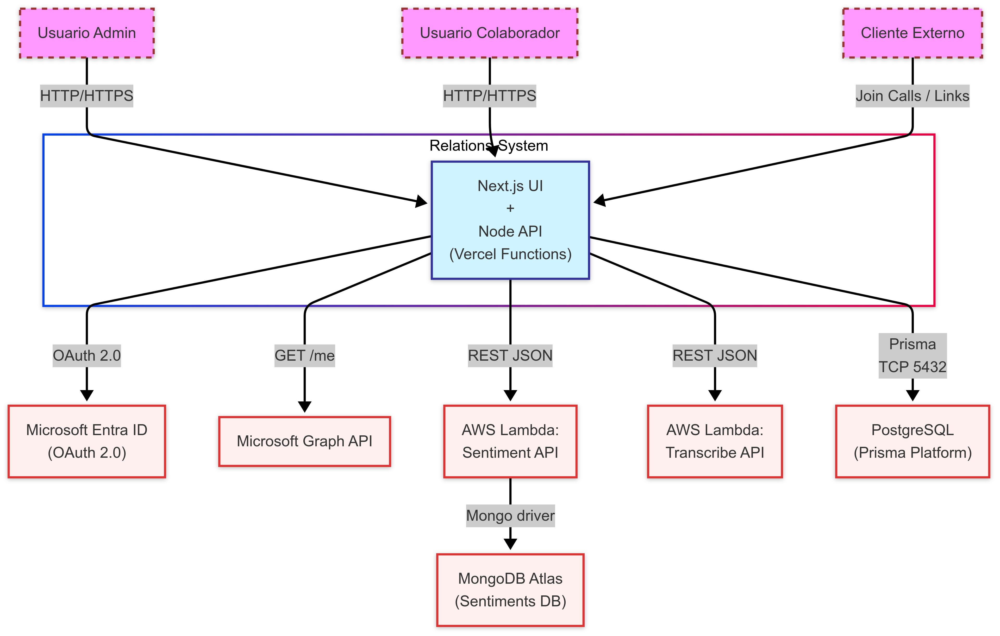

# Relations — Insights de llamadas con IA

Convierte grabaciones de llamadas en **insights accionables**: transcribe, segmenta (chaptering),
analiza sentimiento y organiza todo en proyectos colaborativos, directamente desde la web.

> 🗂️ Esta es la **entrega M2 (Diseño)** de la materia.  
> Consulta el [PDF del diseño arc42](docs/arc42/design-M2.pdf) para detalles completos.
> También está adjunto el mismo archivo pero en formato .md, para mejor lectura dentro del repositorio. [Markdown del diseño arc42](docs/arc42/design-M2.md)

---

## Diagrama de arquitectura de alto nivel



> **Leyenda**  
> UI / Integración / Almacenamiento · Componentes con borde punteado = _Future / Planned_  
> Para una vista ampliada: [context.png](docs/diagrams/context.png)

---

## Características clave

| Módulo | Funcionalidad |
|--------|---------------|
| **Transcripción & Chaptering** | Segmenta archivos .vtt en capítulos temáticos. |
| **Análisis de Sentimiento** | AWS Lambda clasifica cada capítulo (±). |
| **Gestión de Proyectos** | Agrupa llamadas, usuarios y clientes por contexto. |
| **Panel de Actividad** | Historial de acciones de usuario para auditoría. |
| **OAuth 2.0 (Microsoft)** | Login corporativo seguro con PKCE. |
| **Backlog _Future_** | Notificaciones en tiempo real & Reportes PDF avanzados. |

---

## Rápido inicio

```bash
# 1. Clona el repositorio
git clone https://github.com/david1opez/relations-web
cd relations-web

# 2. Instala dependencias (Node 22.14.0)
npm install    # o pnpm/yarn

# 3. Arranca localmente
npm run dev        # Frontend en http://localhost:3000
````

Para la **API** replica los pasos en `/relations-data-api` (requiere `DATABASE_URL` a PostgreSQL).

---

## Variables de entorno

| Componente | Variable                                                   | Propósito                    |
| ---------- | ---------------------------------------------------------- | ---------------------------- |
| Front      | `MSFT_CLIENT_ID`                                           | App ID de Microsoft OAuth    |
|            | `MSFT_REDIRECT_URI`                                        | URL de callback autorizada   |
| Back API   | `DATABASE_URL`                                             | PostgreSQL (Prisma Platform) |
|            | `MSFT_CLIENT_ID` / `MSFT_CLIENT_SECRET` / `MSFT_OBJECT_ID` | OAuth & permisos Graph       |
|            | `MSFT_REDIRECT_URL`                                        | Callback del servidor        |
| Ambos      | `AWS_ANALYSIS_URL` / `AWS_TRANSCRIBE_URL`                  | Endpoints de API Gateway     |
|            | `OPENAI_API_KEY`                                           | Capítulos, Whisper si en uso |

> En desarrollo basta un archivo `.env`; en producción se configuran en **Vercel Dashboard**
> (Proyecto → Settings → Environment Variables).

---

## Documentación de diseño (M2)

| Documento                               | Descripción                                          |
| --------------------------------------- | ---------------------------------------------------- |
| **[design-M2.pdf](docs/design-M2.pdf)** | Documento arc42 completo (12 secciones). |
| **Diagramas**                           | PNG exportados usando el lenguaje de  Mermaid para UML.          |
| **ADR**                                 | Decisiones de arquitectura — carpeta `docs/adr/`.    |

---

## Scripts útiles

| Comando          | Descripción                                  |
| ---------------- | -------------------------------------------- |
| `npm run dev`       | Ejecuta Next.js con Turbopack                |
| `npm run build`     | Build producción Front                       |
| `npm run lint`      | ESLint + Type checking                       |
| `npm run test` (API) | Ejecuta suite Jest                           |
| `vercel --prod`  | Despliega manualmente a Vercel (Front o API) |

*Pipelines de GitHub Actions* despliegan automáticamente el Front; el API
compila y pasa tests, luego se sube con `vercel deploy` (ver `.github/workflows/api-ci.yml`).

---

## Roadmap (*Future / Planned*)

* **Notification Service** — WebSocket push cuando el análisis termina.
* **Advanced Reporting** — PDFs con gráficos de tendencia.
* **ML Fine-Tuning** — Modelo propio para “call intent”.
* **i18n & Accessibility** — Soporte EN/ES + WCAG AA.

Consulta la sección *11. Riesgos y Deuda Técnica* del PDF para detalles y prioridades.

---

## Equipo

| Rol / Especialidad                                         | Nombre completo                              | 
| ---------------------------------------------------------- | -------------------------------------------- |
| Arquitectura y Patrones de Diseño · UX / UI                | Jesús Alonso Galaz Reyes                     | 
| Frontend Developer · Backend Developer                     | Héctor Jesús Tamez Treviño                   |  
| Frontend Developer · Analista de Datos                     | Diego Emilio Rodríguez Orozco                | 
| AI Engineer · Backend Developer                            | Andrés Emiliano de la Garza Rosales          | 
| UX / UI · Frontend Developer                               | David Emiliano González López                |


---

## Licencia

Código publicado bajo licencia **MIT**.
Consulta el archivo [LICENSE](LICENSE) para términos completos.

> *© 2025 Proyecto Relations — Todos los derechos reservados.*
