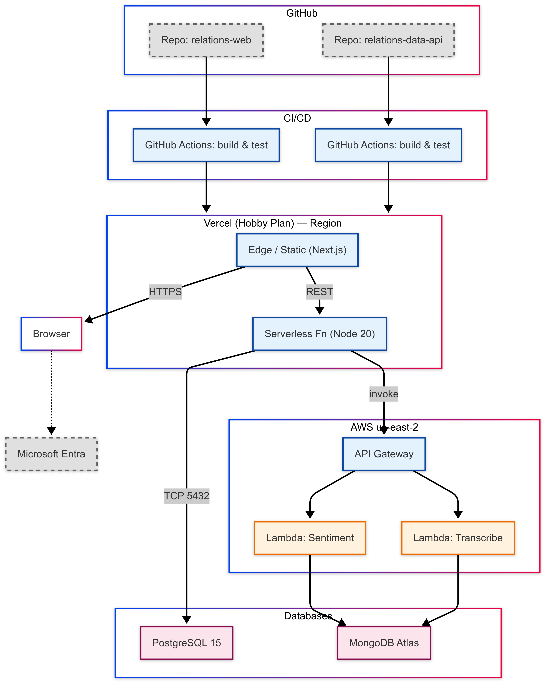

# arc42 – Diseño M2

> **Proyecto:** *Relations – Conversión de llamadas en insights mediante IA*
> **Versión:** 1.0 – *14 Jun 2025*
> **Autores:** Equipo Relations
> *(Jesús A. Galaz R., Héctor J. Tamez T., Diego E. Rodríguez O., Andrés E. de la Garza R., David E. González L.)*
> **Revisión técnica:** Juan Carlos Lavariega

---

## 1. Introducción y objetivos

### 1.1 Propósito del sistema

**Relations** es una plataforma SaaS que transforma grabaciones de llamadas en conocimiento útil para equipos de producto, soporte y operaciones. Utiliza transcripción automática, *chaptering* y análisis de sentimiento para generar **insights** que aceleran la toma de decisiones y el *onboarding* de nuevos integrantes.

### 1.2 Objetivos concretos

* Proporcionar un **flujo unificado** para cargar llamadas, segmentarlas y asociarlas a proyectos.
* Ofrecer **métricas de calidad** (sentimiento, resolución, duración) en un panel centralizado.
* Reducir el tiempo de *onboarding* de un colaborador a **menos de 1 hora**.
* Facilitar la **auditoría** mediante un registro inmutable de actividades.

### 1.3 Audiencia del documento

| Rol                     | Motivación                                                     |
| ----------------------- | -------------------------------------------------------------- |
| Equipo de profesores      | Verificar cumplimiento de rúbrica M2 (15) y lineamientos arc42 |
| Equipo de desarrollo (Relations)   | Mantener o extender módulos existentes                         |
| Operaciones / DevOps (Relations)   | Desplegar, monitorear y escalar en Vercel y AWS                |
| Stakeholders de negocio (Neoris)| Conocer capacidades y roadmap de la plataforma               |

### 1.4 Alcance y límites

| Incluido en M2                     | Fuera de alcance (planeado)    |
| ---------------------------------- | ------------------------------ |
| Carga de grabaciones `.vtt`        | Integración con proveedor VoIP |
| Transcripción y *chaptering* (AWS) | Modelos propios de intención   |
| Análisis de sentimiento            | Notificaciones en tiempo real  |
| Gestión de proyectos y usuarios    | Exportación masiva en PDF      |

---

## 2. Restricciones de arquitectura

| Tipo                | Restricción                                            | Fuente       |
| ------------------- | ------------------------------------------------------ | ------------ |
| **Tecnológica**     | Next.js 15.2.4 + React 19, Node.js 22.14.0             | ADR-001      |
|                     | Prisma 6.9 + PostgreSQL 15                             | ADR-002      |
|                     | MongoDB Atlas (sentimientos/chaptering)                | ADR-005      |
| **Infraestructura** | Vercel Hobby (frontend y API), región *iad1-edge*      | Panel Vercel |
|                     | AWS API Gateway + Lambdas (us-east-2), cuota free-tier | AWS Console  |
| **Proceso**         | Push a `main` = CI/CD en Vercel vía GitHub Actions     | CI/CD        |
| **Licencia**        | MIT                                                    | LICENSE      |

---

## 3. Contexto (vista externa)

### 3.1 Diagrama de contexto

**Convenciones:**

* Actores humanos → borde morado punteado
* Componentes externos → fondo rosa
* Sistema Relations → fondo azul
* Componentes futuros → borde gris punteado
* Flechas con etiquetas de protocolo

### 3.2 Interfaces externas

| Actor / Externo         | Tipo            | Propósito                               | Protocolo/Formato           |
| ----------------------- | --------------- | --------------------------------------- | --------------------------- |
| Usuario Admin           | Humano (web)    | Gestiona usuarios, clientes y proyectos | HTTPS – Next.js UI          |
| Usuario Colaborador     | Humano (web)    | Gestiona llamadas asignadas             | HTTPS                       |
| Cliente externo         | Humano/teléfono | Participa en llamadas, carga `.vtt`     | Telco / carga manual        |
| Microsoft Entra ID      | OAuth 2.0       | Login corporativo (PKCE)                | `login.microsoftonline.com` |
| Microsoft Graph API     | REST JSON       | Perfil y avatar del usuario             | `graph.microsoft.com/v1.0`  |
| AWS Lambda – Sentiment  | REST JSON       | Análisis de sentimiento                 | URL privada AWS             |
| AWS Lambda – Transcribe | REST JSON       | Extrae texto y capítulos de `.vtt`      | URL privada AWS             |
| PostgreSQL (via Prisma) | TCP             | Persistencia de entidades               | Puerto 5432                 |
| MongoDB Atlas (futuro)  | Driver          | Almacén de sentimientos                 | Mongo Driver                |

### 3.3 Justificación de la frontera

* Next.js + API se representa como una caja única en nivel-0
* Lambdas son externas por ejecutarse fuera del runtime Vercel
* PostgreSQL vive fuera de Vercel, accesible por Prisma
* MongoDB Atlas está punteado por estar planeado

---

## 4. Estrategia de solución

| Área          | Decisión                                 | Motivo                           |
| ------------- | ---------------------------------------- | -------------------------------- |
| UI            | Next.js App Router en Vercel             | Familiaridad, SSR nativo         |
| Backend       | Node 22 + Express en Functions           | Ligereza y simplicidad operativa |
| Datos         | Prisma + PostgreSQL                      | Tipado fuerte y ACID             |
| IA/ML         | AWS Lambda para análisis y transcripción | Mantiene el backend ligero       |
| Autenticación | OAuth 2.0 con Entra ID                   | Seguridad corporativa            |

---

## 5. Vista de bloques

### 5.1 Nivel 0

Ver diagrama de contexto.

### 5.2 Nivel 1 – Componentes internos

| Componente           | Capa           | Tecnología           | Rol principal                        |
| -------------------- | -------------- | -------------------- | ------------------------------------ |
| UI Layer             | UI             | Next.js 15, React 19 | Páginas principales                  |
| Auth Module          | Integración    | Next.js, OAuth Entra | Autenticación                        |
| CallsService         | Integración    | Fetch API            | CRUD de llamadas                     |
| ProjectsService      | Integración    | Fetch API            | CRUD de proyectos                    |
| UsersService         | Integración    | Fetch API            | Usuarios y roles                     |
| ActivityLog Service  | Integración    | Fetch + localStorage | Auditoría UI/Backend                 |
| Backend Routes       | Integración    | Express Router       | Endpoints REST                       |
| Handlers             | Dominio        | TypeScript           | Validación, DTOs                     |
| Controllers          | Dominio        | TypeScript           | Orquestación                         |
| Services             | Dominio        | Prisma               | Lógica de negocio                    |
| Prisma Client        | Almacenamiento | Prisma 6             | Acceso relacional                    |
| Mongo SentimentStore | Almacenamiento | MongoDB Atlas        | Análisis semiestructurado *(futuro)* |
| Notification Service | Dominio        | WebSockets           | Push tiempo real *(futuro)*          |

### 5.3 Mapeo tecnológico

Ver diagrama `technology-mapping.png` en `docs/diagrams/`.

---

## 6. Vista de ejecución

Flujos principales documentados gráficamente en `docs/diagrams/`:

1. Login vía OAuth
2. Crear proyecto y llamada
3. Registrar actividad
4. Generar reporte

---

## 7. Vista de despliegue (Deployment View)

**Variables de entorno clave:**

* **Frontend:** `MSFT_CLIENT_ID`, `MSFT_REDIRECT_URI`
* **Backend:** `DATABASE_URL`, `MSFT_CLIENT_SECRET`, `MSFT_OBJECT_ID`
* **Otros:** `AWS_ANALYSIS_URL`, `AWS_TRANSCRIBE_URL`, `OPENAI_API_KEY`

---

## 8. Conceptos transversales

Incluye:

* Seguridad: OAuth PKCE, CORS
* Configuración: `.env`, variables Vercel
* Auditoría: `ActivityLog`
* Logging básico
* Planes para métricas y tracing con OTEL

---

## 9. Decisiones de arquitectura (ADRs)

| ID      | Decisión                             | Estado   |
| ------- | ------------------------------------ | -------- |
| ADR-001 | Next.js App Router para UI           | Aceptada |
| ADR-002 | Prisma ORM + PostgreSQL              | Aceptada |
| ADR-003 | Monolito modular sobre Vercel        | Aceptada |
| ADR-004 | OAuth 2.0 con Microsoft Entra ID     | Aceptada |
| ADR-005 | MongoDB para sentimientos/chaptering | Planeada |

---

## 10. Requisitos de calidad

**Utility Tree / KPIs esperados:**

* Rendimiento: `< 300 ms` P95
* Disponibilidad: `≥ 99.5 %`
* Cobertura de tests: `≥ 60 %`
* Seguridad: OAuth 2.0, RBAC
* Usabilidad: onboarding < 1h

---

## 11. Riesgos y deuda técnica

| Riesgo                     | Impacto               | Prob. | Mitigación / Responsable       |
| -------------------------- | --------------------- | ----- | ------------------------------ |
| Límites free-tier          | Downtime / throttling | Media | Escalar plan – *David L.*      |
| Conexiones DB excedidas    | Errores de pool       | Baja  | PgBouncer – *Andrés G.*        |
| Cuotas Microsoft Graph API | Login bloqueado       | Baja  | Cache + fallback – *Héctor T.* |
| Falta de tests end-to-end  | Bugs regresivos       | Alta  | Playwright – *Diego R.*        |
| Baja observabilidad        | Dificultad debug      | Media | OTEL + dashboard – *Jesús G.*  |
| Lock-in Vercel             | Costo migración       | Baja  | Dockerfile alternativo         |

---

## 12. Glosario

| Término       | Definición                                       |
| ------------- | ------------------------------------------------ |
| Call          | Llamada con transcripción y metadatos            |
| Chaptering    | Segmentación de transcripción                    |
| Sentiment     | Polaridad emocional por IA                       |
| ActivityLog   | Registro auditable de acciones                   |
| Entra ID      | Identidad corporativa de Microsoft (ex Azure AD) |
| Edge Function | Función serverless en la red de borde de Vercel  |
